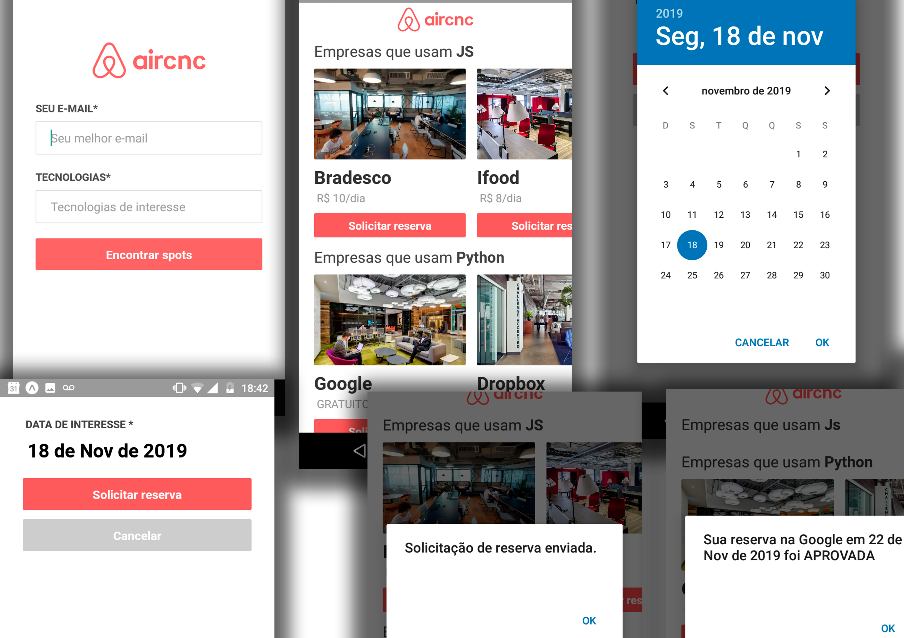

<h1 align="center">
<br>

<br>
<br>
Aircnc - Air Code and Coffee💻☕️
</h1>

<h3 align="center">Site</h3>

<br/>
<h3 align="center">Aplicativo Mobile</h3>

<br/>
Projeto desenvolvido durante a semana OmniStack da [Rocketseat](https://github.com/Rocketseat/semana-omnistack-9). Aplicação fullstack que permite realizar a reserva de Spots para empresas e desenvolvedores, em tempo real utilizando **socket.io**.

## Instalação
### Backend/API
Clone este repositório e instale as dependências dentro da pasta `aircnc/backend`
```sh
git clone https://github.com/rafaelsouz/aircnc.git
cd aircnc/backend
yarn
# ou
npm install
```
- No arquivo `config/database` incluir em `DB_URL` sua URL de conexão com o banco de dados **MongoDB**
- No arquivo `config/localhost` incluir em `LOCALHOST` seu localhost ou IP da máquina caso utilize dispositivo físico
### Rodar Backend/API
```
yarn dev
```
> Lembre-se de deixar rodando o backend...
### Frontend
Instale as dependências dentro da pasta `aircnc/frontend`
> Em um novo terminal execute os comandos:
```sh
cd frontend
yarn
# ou
npm install
```
### Rodar Frontend
```
yarn start
```
### App Mobile
O modo mais fácil de rodar esse aplicativo no **Android** é utilizando o [Expo](https://expo.io/).
Primeiro instale o `expo-cli` de forma global em sua máquina. 
Dentro da pasta `aircnc/mobile` instale as dependências do app, em seguida execute o app.
```
npm install -g expo-cli
yarn
yarn start
``` 
Ao abrir uma aba em seu navegador do **Expo DevTools** com o **QRCode**, baixe o aplicativo do **Expo** em sua [play store](https://play.google.com/store/apps/details?id=host.exp.exponent) e faça o Scan do QRCode em seu celular.

- No arquivo `config/localhost` incluir em `LOCALHOST` a mesma configuração do Backend.